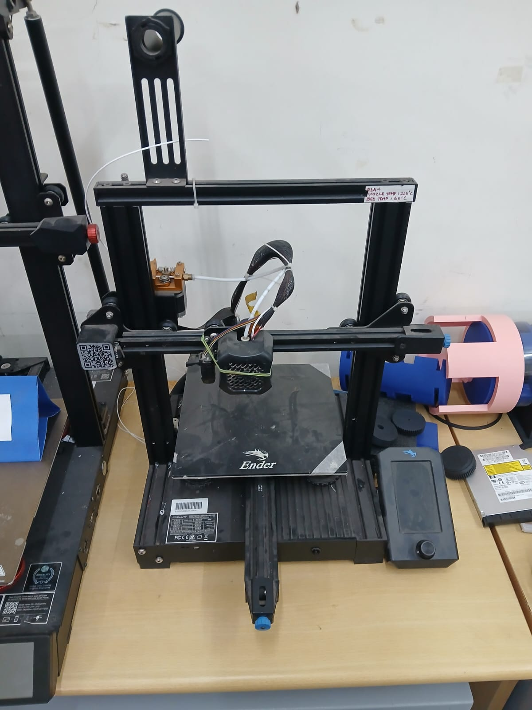

# 3-D PRINTING

3-D priniting is the next big thing in the manufacturing industry 
additive 3-d printing and metal printing are the ones being worked upon now 
In 3-D printing the plastic filament of the desired type of material is selected and used to print the model we want 
This is mainly used becasue it increses the accuracy and precision of the parts being printed 
It's easy to print it then to make a mould ofr it and use it to manufacture 
It consumes a lot of less time and requires less human labour and efforts 

 

### OBJECTIVES OF THE TASK :
Understand the working of a 3D printer 
Understand what's an STL file, and then learn to slice it  

### My Understanding :

Major components of a 3-D printer are the:

X,Y,Z axised frame  

Heated printing nozzle:the plastic filament gets heated and the stepper motors prints it accuratekly layer by layer the heated plastuc flows out through the nozzle getting printed layer by layer 

Filament roll: the desired material for the printing is selected and its composite roll is placed to be fed the printing unit 

Printing bed:all the heated filament gets printed on this printing bed it's where the final piece is present after printing it is coated with non adhesive and sticky coatings of ceramics and glss so that the printed piece dosent stick to the printe bed andit can be easily emoved after printing

STL files :
It stands for stereolithography its the most comman file format used in 3D printing 
It describes the surface geometry of the of the 3D model 
It's basically a file extension which saves the file the stk format
I used cults website to download the 3d model in stl format 

SLICING:
It's the bridge between our 3D model and the 3D printer 
It's a software that instructs the 3D printer how to print layer by layer our model to obtain the final piece 
It divide the model into many thin horizontal layers where each gets printed in a sequential order 
I used Ultimaker Cura TO slice the 3D model which I downloaded from cults to understand how slicing happens saw a youtube video on how to work in it 

### Conclusion :
How a 3D printer works 
The principles whic it harnours 
How the melted filament gets printed 
What is an STL file , why it's important 
What is Slicing and why its important for 3D printing 
How a file or model gets printed on the slicing principle
 

