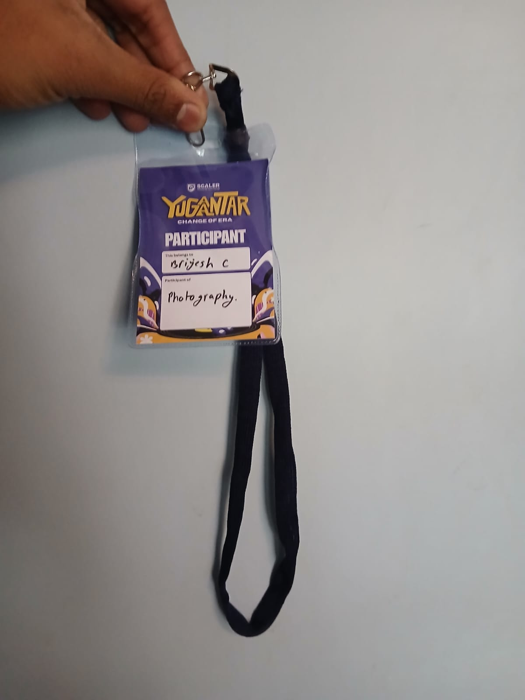

# ACTIVE PARTICIPATION 

### OBJECTIVES :

Participate in an Technical event
Ateend any MOOC and complete the course 

### MY learning and experiences :

I participated in the scaler school of technology's tech fest YUGANTARA althouh the category in which I particiapted cannot be called as technical event I did explore many onging e-sports tournaments , the poster printing they had set up 
looked around their R&D labs 
explored the type of projects they ar workinfg on currently
How they are using latest technology like AI in their works to make it more efficient and productive 
had many interactions with many seniors of the clg and the guests they had invited to do seminars 
participated in one of the seminars they held about the ceo of a leading upi payments app whise name i forgot but still remember the insights and values he tried to convey 

In udemy i've done a matlab course which wss free and open for all asoer the mooc course specifications 
It taughtv me about matlab it's interface its working principle etc. 
It's basically a calculator for Engineers 

 
 