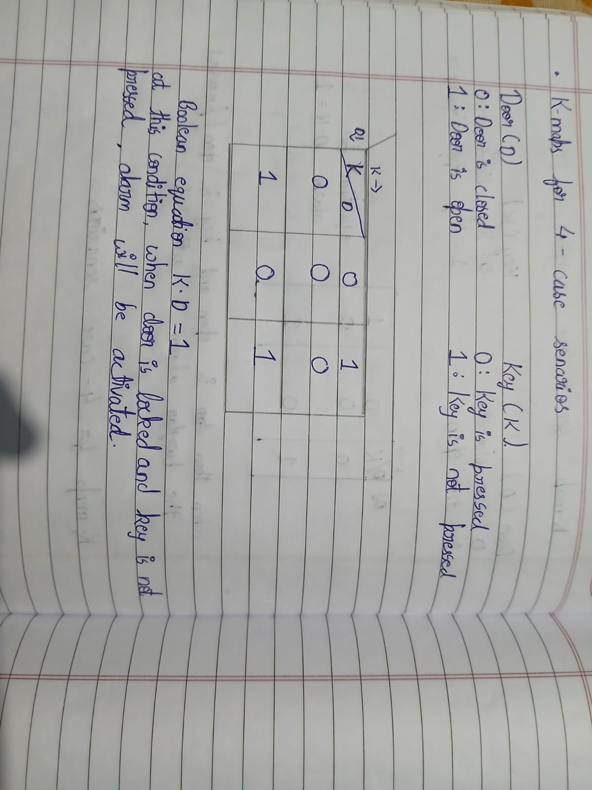

# K-MAP AND DERIVING LOGIVE GATES

### K-MAP :

A Karnaugh Map is a graphical method used to simplify Boolean expressions. Instead of algebraic manipulation, you place values from the truth table into a grid and group them to find the simplest logic equation.
  
### LOGIC GATES :

Logic gates are electronic devices that perform basic Boolean operations (AND, OR, NOT, etc.) on one or more inputs to produce a single output. They’re the foundation of digital electronics, used in computers, alarms, calculators, and more.

### OBJECTIVES :

Determine the K-MAP and make a burglar alarm system using simple logic circuits. The buzzer or led's blinks when certain conditions are met, it utilizes push buttons for the door and key.

### My Learnings :

Understood what a are logical gates , it's representation and it types  , how it functions and the typess of operations it performs 

Understood about K-Maps how to draw one and how to write it's truth tables and how to prove any given logical exquation using booloean algebra and how to draw truth tables for these boolean algebraic expressions

The burglar system activates the alarm when the door is open and the key is pressed. The alarm works on this principke that if the door is opened by an authoried entry and the key is again being pressed it's being pressed by an intruder 

The K-MAP explaining this can be seen below :

