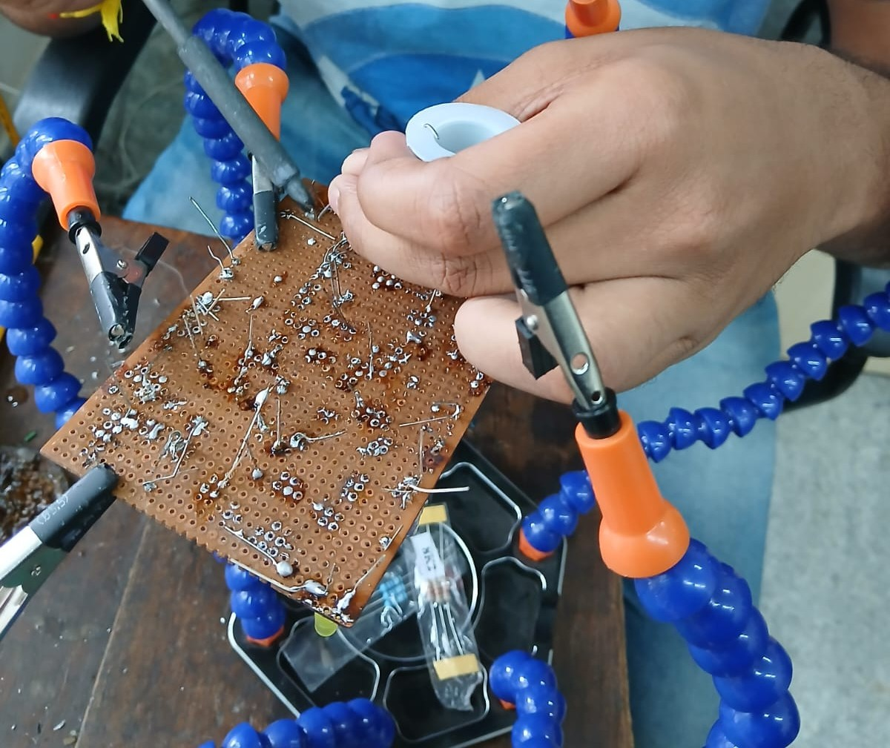

# SOLDERING PRE-REQUISITES

Soldering is a process used to join two or more metal parts together by melting a filler metal called solder. The solder cools and solidifies, creating both a mechanical and electrical connection.

### OBJRCTIVES :
Learn about the various parts of the soldering meachine 
Learn about solering filaments (solder) and wax 
Learn how to soleder 

### My Learnings :
The working pinciple o the soldering machine , i.e the process of heating the tip of the metal 
Curie's temperature 
How to clean the tip 
The tip is the part which gets the most heated so its important to handle it properly 
How to solder elcectronic boards and circuits 
The dont's was better learrnt than the do's 
wax is used so that thers no like dust particles or other contaminations on the soldering tip which might interfere in  soldering 
How to clean the tip using the sandpaper 
How to de-solder although I didn't use the actual de-soldering machine I learnt how to use it
and when to use it 
How to control the voltage which regulates the amount of heat needed to be used 

